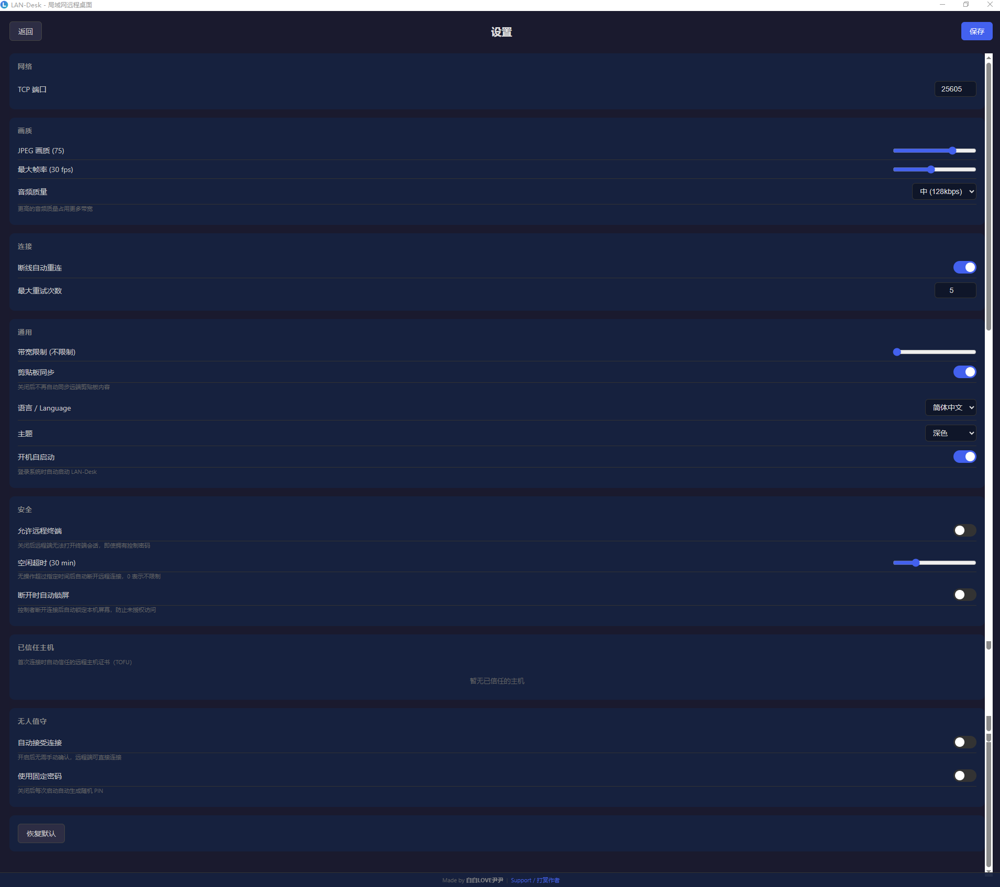

**中文** | [English](README_EN.md)

# LAN-Desk


局域网远程桌面工具，支持屏幕查看、键鼠控制和双向剪贴板同步。

## 界面预览

### 设备发现页
> 显示本机 PIN、手动输入 IP 连接、UDP 局域网扫描设备、连接历史、Wake-on-LAN


### 远程桌面控制
> 实时远程画面、键鼠控制、FPS/延迟/带宽/RTT/CPU/内存统计、多显示器切换、录制、标注、文件传输


### 设置页面
> TCP 端口、JPEG 画质、最大帧率、带宽限制、自动重连、语言切换



### 连接授权弹窗
> 被控端收到连接请求时弹窗确认，30 秒超时自动拒绝


### 打赏页面
> 微信支付、支付宝、Buy Me a Coffee、GitHub Sponsors


## 功能

- **屏幕查看**：实时查看远程桌面画面（JPEG 编码 + 脏矩形增量传输）
- **键鼠控制**：通过鼠标和键盘远程操控对方电脑
- **剪贴板同步**：双向自动同步文本剪贴板（可在设置中关闭）
- **局域网发现**：UDP 广播自动发现同一网络内的设备
- **自适应优化**：根据屏幕变化动态调节帧率（5-60fps）和画质
- **文字聊天**：远程会话中支持即时文字通信
- **连接密码**：8 位随机 PIN 码保护，防止未授权访问；指数退避暴力破解防护（5次→5分钟→15分钟→…→24小时封顶 + 全局限流）
- **授权确认**：被控端弹窗确认，显示请求的权限类型（完全控制/仅查看），30 秒超时自动拒绝
- **断开时自动锁屏**：远程会话断开时自动锁定被控端屏幕（跨平台，可配置）
- **屏幕遮蔽**：防止被控端旁人窥视远程操作内容（可配置）
- **TLS 加密**：全部 TCP 通信经 TLS 加密，防止局域网嗅探；证书持久化，重启后保持指纹；私钥使用 AES-256-GCM 认证加密存储（HKDF-SHA256 密钥派生 + 跨平台机器标识绑定，自动迁移旧格式）
- **断线重连**：网络抖动后自动重连（指数退避，最多 5 次）
- **远程重启后自动重连**：检测到被控端重启后自动恢复会话
- **多标签/多会话**：同时连接多台远程设备，标签页切换
- **深色/浅色主题切换**：支持跟随系统主题自动切换
- **免安装运行**：便携模式，exe 同目录放置 `.portable` 标记文件即可免安装运行
- **全屏模式**：一键全屏查看远程桌面
- **会话空闲超时**：可配置空闲超时（默认 30 分钟），超时自动断开连接
- **心跳检测**：5 秒心跳，15 秒超时自动断开
- **远程光标**：被控端鼠标位置实时叠加显示（红色圆圈）
- **系统托盘**：关闭窗口最小化到托盘后台运行
- **设置页面**：可配置端口、JPEG 画质、最大帧率、重连策略
- **快捷键透传**：支持 Ctrl+Alt+Del、Alt+Tab、Alt+F4 等系统快捷键透传到被控端
- **键盘映射**：基于 KeyboardEvent.code 的物理键位映射（80+ 键位）
- **macOS 支持**：CGDisplayCreateImage 屏幕捕获 + CGEvent 输入注入 + macOS 键码映射
- **多显示器**：枚举显示器列表，控制端可选择查看哪个显示器
- **文件传输**：Tauri 文件对话框选择 + 64KB 分块传输 + 进度事件
- **双向文件传输 + 远程文件浏览器**：双栏布局，支持上传/下载，远程目录浏览
- **目录传输 + 断点续传**：支持整个目录传输，断点续传避免重复传输已完成部分
- **DPI 适配**：自动检测被控端 DPI 缩放比例，传递给控制端补偿坐标
- **DXGI 自动恢复**：锁屏、UAC、桌面切换后自动重建屏幕捕获
- **光标形状同步**：同步 12 种系统光标形状（箭头、文本、手形、等待等）
- **多显示器切换**：实际重建捕获线程切换到目标显示器
- **音频转发**：cpal 捕获系统音频 → Opus 编码传输（~128kbps，PCM 自动降级） → Web Audio API 播放
- **网络质量指示器**：RTT 实时监测，绿/黄/红三色信号灯（<30ms / <100ms / >100ms）
- **连接历史**：记住最近 10 个连接设备，一键填充 IP
- **国际化**：中文/英文切换（229 个翻译 key，全 UI 覆盖），设置页可选
- **单元测试**：207 个前端测试 + 153 个 Rust 单元测试，覆盖协议编解码、帧编码、键盘映射、PIN 生成、速率限制、TLS 等
- **CI/CD**：GitHub Actions 自动测试 + 构建 Windows MSI / macOS DMG / Linux deb / Android APK / iOS IPA + ESLint 检查
- **多用户查看**：1 个控制者 + 不限数量的只读观察者同时连接
- **会话录制**：Canvas 录制为 WebM 视频（VP9 编码），一键下载
- **Wake-on-LAN**：输入 MAC 地址发送魔术包远程唤醒电脑
- **白板标注**：在远程画面上自由绘制线条标注，协作演示用
- **带宽节流**：可配置最大带宽（Mbps），超限自动跳帧
- **H.264 编码**：OpenH264 视频编码（I/P 帧），比 JPEG 压缩率高 5-10 倍，前端 WebCodecs VideoDecoder 解码
- **PIN 哈希**：连接密码通过 Argon2id + 随机 salt 哈希后传输（内存 19MB，迭代 2 次），每次连接重新生成 salt，防暴力破解和预计算攻击
- **文件校验**：传输完成时发送 SHA256 校验和验证完整性
- **音频 jitter buffer**：100ms 缓冲延迟，吸收网络抖动
- **共享帧广播**：所有连接共享 1 个捕获线程（broadcast channel），不再每连接一个独立线程
- **剪贴板图片同步**：支持截图等图片类型的双向剪贴板同步（PNG 编码传输）
- **系统信息面板**：实时显示被控端 CPU 和内存使用率
- **双 PIN 权限控制**：控制密码（完全权限）+ 查看密码（仅观看），不同密码对应不同权限
- **无人值守模式**：支持固定密码 + 自动接受连接，适合远程管理无人电脑
- **远程终端**：PTY 远程 Shell（xterm.js），支持交互式命令行、窗口大小调整、UTF-8 编码支持（默认禁用，需在设置中手动启用以增强安全性）
- **Linux 支持**：X11 XShm 屏幕捕获 + XTest 输入注入，原生 Wayland 支持（PipeWire/Portal 零工具截屏，grim/spectacle 降级方案 + ydotool/dotool 输入注入，三级 fallback：PipeWire/Portal → Wayland 外部工具 → X11 XShm；支持 GNOME、KDE、Sway、Hyprland）
- **H.265/HEVC 硬件编码**：NVENC HEVC 硬件编码支持，自动回退 H.264
- **AV1 编码支持**：预留 AV1 编码接口，待 GPU 硬件编码器可用时启用
- **GPU 硬件编码**：NVENC (Windows) / VideoToolbox (macOS) / VAAPI (Linux) 自动检测，回退 OpenH264 软编码
- **自适应比特率**：基于 RTT 和带宽利用率动态调整编码质量，优化网络波动下的画面体验
- **WebSocket 二进制传输**：帧/音频数据通过本地 WebSocket 二进制推送，绕过 Tauri JSON IPC，消除 base64 ~33% 开销
- **TOFU 证书管理 UI**：在设置页面查看和撤销已信任的远程主机指纹
- **macOS 权限自动检测引导**：屏幕录制（CGPreflightScreenCaptureAccess）+ 辅助功能（AXIsProcessTrusted）自动检测与引导
- **Shell 空闲超时 + 审计日志**：远程终端 30 分钟空闲自动关闭 + 结构化审计日志（target: "audit"）
- **Windows 多显示器增强**：虚拟屏幕坐标（SM_CXVIRTUALSCREEN + MOUSEEVENTF_VIRTUALDESK）+ Per-System DPI（GetDpiForSystem）
- **macOS 剪贴板原生检测**：使用 NSPasteboard.changeCount 原生 FFI 替代内容哈希轮询
- **文件传输取消**：传输过程中可随时取消
- **目录下载**：从被控端下载整个目录
- **文件拖拽上传**：拖拽文件到远程桌面窗口直接上传
- **开机自启动**：设置中可开启登录时自动启动
- **JPEG 并行编码**：rayon 多核并行编码脏区域
- **连接历史别名**：可为历史连接设置自定义名称
- **终端高度可拖拽调整**：终端面板高度支持拖拽调整
- **工具栏分组收纳**：工具和远程控制下拉菜单
- **编码器类型实时显示**：实时显示当前编码器类型（H.264/HEVC/JPEG）
- **音频质量可配置**：低/中/高三档音频质量设置
- **网络质量 RTT 趋势图**：RTT 实时趋势迷你图
- **TOFU 证书变更确认框**：远程主机证书变更时弹窗确认
- **设备 ID**：9 位数字唯一标识，替代 IP 作为设备身份
- **会话录制回放**：IndexedDB 存储录制数据 + 内置播放器回放
- **文件传输完成通知**：传输完成后弹出系统 Notification 通知
- **远程截图保存**：一键 PNG 截图保存远程桌面画面
- **连接密码记忆**：可选记住密码，免重复输入
- **标注文字工具**：画笔 + 文字双工具，支持在远程画面上标注文字
- **多显示器下拉菜单**：显示分辨率和主屏标记，快捷切换显示器
- **快捷键帮助面板**：F1 弹出快捷键帮助面板
- **连接统计导出**：连接历史导出为 CSV 格式
- **便携模式托盘标识**：系统托盘图标显示 [P] 标记表示便携模式
- **聊天消息通知音**：收到聊天消息时播放提示音
- **系统信息增强**：系统信息面板显示内存总量
- **连接信息复制**：一键复制设备 ID + 端口信息
- **设备 ID 连接**：输入 9 位设备 ID 自动 UDP 扫描匹配，无需记 IP 地址
- **Tailscale/ZeroTier 检测**：自动检测 VPN 虚拟网卡并高亮显示，跨网络连接更便捷
- **Android / iOS 移动端**：手机/平板作为控制端远程操控桌面电脑，触屏手势映射（单指移动、轻触点击、长按右键、双指滚轮）+ 虚拟键盘 + 响应式布局

详见 [贡献指南](CONTRIBUTING.md)。

## 技术栈

- **后端**：Rust + Tokio（异步运行时）
- **前端**：Vue 3 + TypeScript
- **桌面框架**：Tauri v2
- **屏幕捕获**：Windows DXGI Desktop Duplication（独立线程）
- **输入注入**：Windows SendInput API
- **加密**：TLS 1.3（tokio-rustls + 自签名证书）
- **视频编码**：OpenH264 + JPEG（image crate）
- **音频编码**：Opus（~128kbps，PCM16 自动降级）
- **本地推送**：WebSocket 二进制通道（127.0.0.1，帧/音频数据）

## 系统要求

- **Windows**：Windows 10 或更高版本
- **macOS**：macOS 12.3+（需要屏幕录制和辅助功能权限）
- **Linux**：X11 桌面环境，原生 Wayland 支持（PipeWire/Portal 零工具截屏 + grim/spectacle 降级方案 + ydotool/dotool 输入注入，三级 fallback：PipeWire/Portal → Wayland 外部工具 → X11 XShm）

## 使用场景

### 局域网（默认）
同一 WiFi / 有线网络内直接连接，零配置，延迟 <5ms。

### 跨网络 / 公网（通过内网穿透）
借助 Tailscale、ZeroTier、frp、ngrok 等工具，可实现**任意网络**远程控制：

| 方案 | 一句话说明 |
|------|-----------|
| **Tailscale**（推荐） | 两端装好登录同账号，用分配的 IP 连接，最简单 |
| **ZeroTier** | 类似 Tailscale，免费支持 25 台设备 |
| **Cloudflare Tunnel** | 免费，利用 Cloudflare 全球网络，稳定快速 |
| **frp** | 自建公网服务器转发，适合企业 |
| **ngrok** | 一行命令临时穿透，适合偶尔使用 |

👉 详细操作指南：[跨网络远程访问指南](docs/REMOTE_ACCESS.md)

## 快速开始

### 方式一：下载可执行文件（推荐非研发人员）

前往 [Releases](https://github.com/bbyybb/lan-desk/releases/latest) 下载对应平台的安装包：

| 平台 | 文件 | 安装方式 |
|------|------|----------|
| Windows | `LAN-Desk_x.x.x_x64.msi` | 双击安装，桌面快捷方式启动 |
| macOS (Apple Silicon) | `LAN-Desk_x.x.x_aarch64.dmg` | 双击挂载，拖入 Applications |
| macOS (Intel) | `LAN-Desk_x.x.x_x64.dmg` | 同上 |
| Linux (Debian/Ubuntu) | `lan-desk_x.x.x_amd64.deb` | `sudo dpkg -i lan-desk_*.deb` |
| Linux (通用) | `lan-desk_x.x.x_amd64.AppImage` | `chmod +x *.AppImage && ./*.AppImage` |

> **macOS 用户注意**：首次运行需在 系统设置 → 隐私与安全 中授权：
> 1. **屏幕录制**（屏幕捕获必需）
> 2. **辅助功能**（键鼠控制必需）
>
> **音频转发**：macOS 不支持直接捕获系统音频（loopback），需安装虚拟音频设备（如 [BlackHole](https://github.com/ExistentialAudio/BlackHole) 或 [SoundFlower](https://github.com/mattingalls/Soundflower)），并在系统设置中将其设为默认输出设备。

### 方式二：从源码构建（研发人员）

#### 前置依赖

- [Rust](https://rustup.rs/) (stable)
- [Node.js](https://nodejs.org/) (v18+)
- npm
- [cmake](https://cmake.org/) (>= 3.10，**可选**，用于 Opus 音频编码)

#### 开发模式

```bash
cd lan-desk
npm install
npm run tauri dev
```

#### 构建发布版本

```bash
# 自动检测 cmake，有则启用 Opus 音频编码（带宽降低 92%），无则回退 PCM
npm run build:release

# 或手动控制
FORCE_OPUS=1 npm run build:release   # 强制启用 Opus（需有 cmake）
FORCE_OPUS=0 npm run build:release   # 强制禁用 Opus
npm run build:release-no-opus        # 直接跳过检测
```

> **Opus 自动检测**：构建时自动检测 cmake 是否可用（版本 >= 3.10），如可用则编译 libopus 并启用 Opus 音频编码。无 cmake 时所有功能正常工作，音频以 PCM 原始格式传输。安装 cmake 后重新构建即可自动获得 Opus 支持。

## 使用方法

1. 在两台局域网内的电脑上分别运行 LAN-Desk
2. 应用启动后自动作为被控端监听 TCP 25605 端口
3. 在控制端输入被控端 IP 地址（如 `192.168.1.10`）点击"连接"
4. 或点击"扫描"自动发现局域网内的其他 LAN-Desk 实例

## 项目结构

```
lan-desk/
├── Cargo.toml                     # Rust workspace 配置
├── package.json                   # 前端依赖
├── src-tauri/                     # Tauri 应用入口
│   ├── src/
│   │   ├── main.rs                # 程序入口
│   │   ├── lib.rs                 # Tauri 初始化
│   │   ├── commands/              # 前端 Tauri 命令（模块化拆分）
│   │   └── state.rs               # 全局状态管理
│   └── tauri.conf.json
├── crates/
│   ├── lan-desk-protocol/         # 网络协议（44 种消息、帧编解码、UDP 发现）
│   ├── lan-desk-capture/          # 屏幕捕获（DXGI/CGDisplay + JPEG/H.264 编码）
│   ├── lan-desk-input/            # 输入注入（Win SendInput / Mac CGEvent）
│   ├── lan-desk-clipboard/        # 剪贴板同步（arboard + xxhash 防回环）
│   ├── lan-desk-server/           # 被控端服务（多会话 + TLS + 自适应帧率）
│   └── lan-desk-audio/            # 音频捕获（cpal loopback）
└── src/                           # Vue 3 前端
    ├── App.vue                    # 根组件（路由切换）
    ├── composables/               # Vue Composable 模块
    │   ├── useSettings.ts         # 全局设置管理
    │   ├── useFrameRenderer.ts    # 帧渲染
    │   ├── useInputHandler.ts     # 鼠标键盘事件
    │   ├── useRemoteCursor.ts     # 远程光标
    │   ├── useReconnect.ts        # 断线重连
    │   ├── useStats.ts            # 统计指标
    │   ├── useAudio.ts            # 音频播放
    │   ├── useAnnotation.ts       # 白板标注
    │   ├── useRecording.ts        # 会话录制
    │   └── useToast.ts            # Toast 通知管理
    ├── views/
    │   ├── Discovery.vue          # 设备发现页
    │   ├── RemoteView.vue         # 远程桌面查看/控制页
    │   └── Settings.vue           # 设置页（端口/画质/帧率）
    └── styles/main.css
```

## 网络协议

| 通道 | 端口 | 用途 |
|------|------|------|
| TCP | 25605 | 控制指令 + 屏幕帧数据 |
| UDP | 25606 | 局域网设备发现广播 |
| WebSocket | 动态 (127.0.0.1) | 本地帧/音频二进制推送 |

消息格式：4 字节长度前缀 + MessagePack 序列化
音频编码：Opus（~128kbps）/ PCM16 自动降级

## 自适应策略

| 屏幕状态 | 帧率 | JPEG 画质 |
|----------|------|-----------|
| 完全静止（>30 空帧） | 5 fps | 85 |
| 小面积变化 | 15 fps | 75 |
| 中面积变化 | 20 fps | 60 |
| 大面积变化（>50%） | 60 fps | 30-50 |

## 打赏 / Support

如果这个项目对你有帮助，欢迎打赏支持！

### 国内打赏

<div style="display:flex;gap:20px;justify-content:center">
  <div align="center">
    
    <br><b>微信支付</b>
  </div>
  <div align="center">
    
    <br><b>支付宝</b>
  </div>
</div>

### International

<div align="center">
  <a href="https://www.buymeacoffee.com/bbyybb">
    
  </a>
  <br><b>☕ Buy Me a Coffee</b>
</div>

- ☕ [Buy Me a Coffee](https://www.buymeacoffee.com/bbyybb)
- 💖 [GitHub Sponsors](https://github.com/sponsors/bbyybb/)

## 作者

Made by **白白LOVE尹尹** (bbyybb)

<!-- LANDESK-bbloveyy-2026 -->

## 许可证

[MIT](LICENSE)
