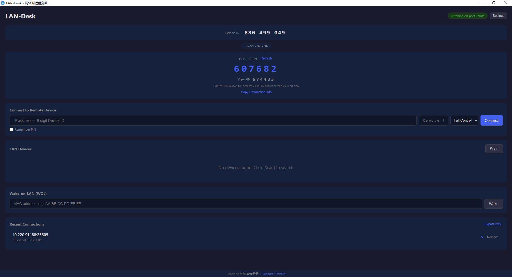
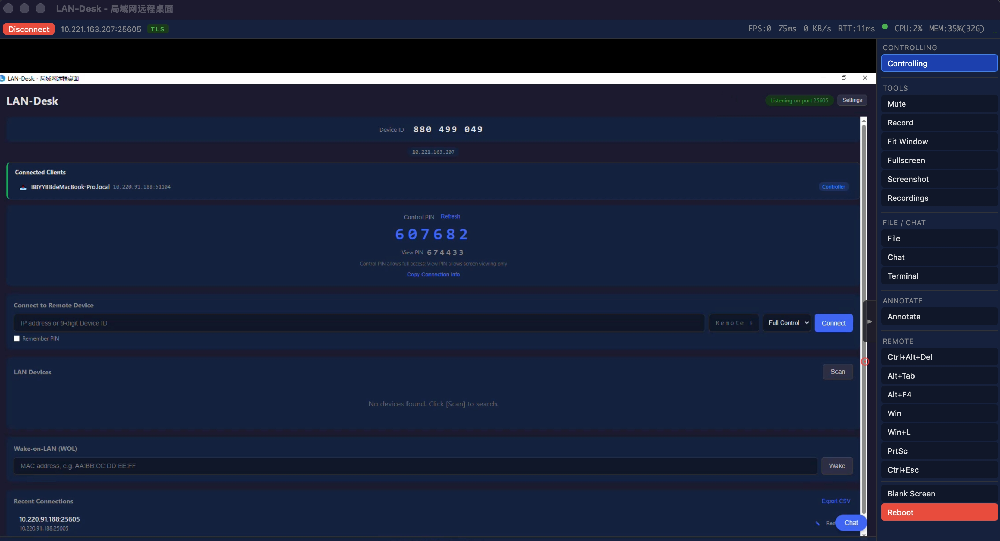
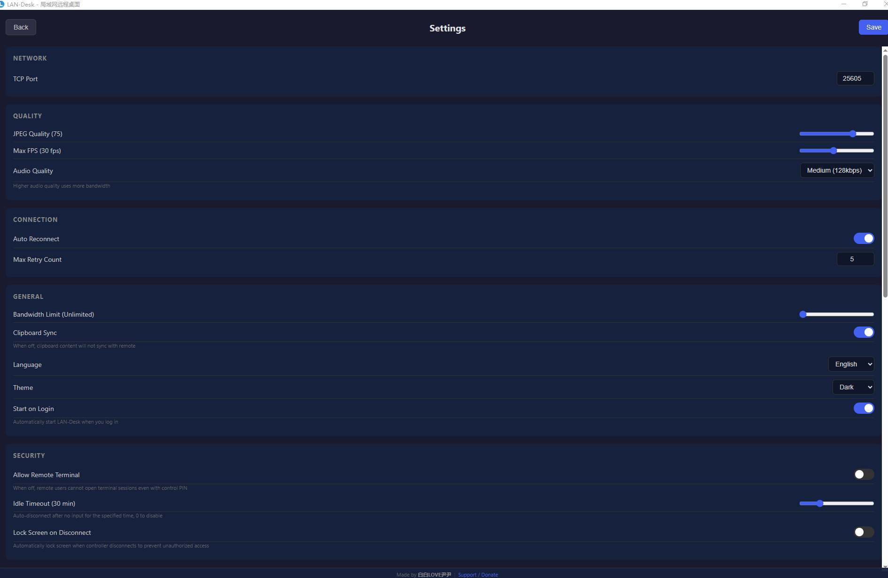
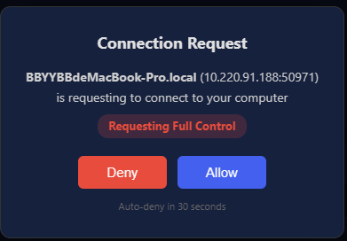
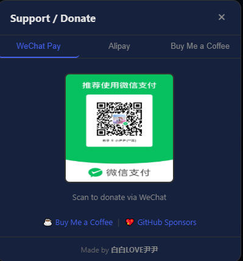

[中文](README.md) | **English**

# LAN-Desk


A LAN remote desktop tool with screen viewing, keyboard/mouse control, and clipboard sync.

## Screenshots

### Device Discovery
> Local PIN display, manual IP connection, UDP LAN device scanning, connection history, Wake-on-LAN



### Remote Desktop
> Real-time remote view, keyboard/mouse control, FPS/latency/bandwidth/RTT/CPU/memory stats, multi-monitor switch, recording, annotation, file transfer



### Settings
> TCP port, JPEG quality, max FPS, bandwidth limit, auto reconnect, language switch



### Authorization Dialog
> Host-side popup on incoming connection, auto-deny after 30 seconds



### Donate
> WeChat Pay, Alipay, Buy Me a Coffee, GitHub Sponsors



## Features

- **Screen Viewing**: Real-time remote desktop (JPEG + H.264 encoding, dirty rect detection)
- **Keyboard & Mouse Control**: Full remote input (Windows SendInput / macOS CGEvent)
- **Clipboard Sync**: Bidirectional text & image clipboard sync (can be disabled in Settings)
- **LAN Discovery**: UDP broadcast auto-discovery
- **Adaptive Quality**: Dynamic framerate (5-60fps) and JPEG quality
- **Text Chat**: Instant text messaging during remote sessions
- **PIN Authentication**: 8-digit PIN + Argon2id hashed transmission; exponential backoff brute-force protection (5 failures → 5min → 15min → … → 24h max + global rate limit)
- **Auto Lock Screen on Disconnect**: Automatically locks the host screen when remote session disconnects (cross-platform, configurable)
- **Screen Blanking**: Prevents bystanders on the host side from viewing remote operations (configurable)
- **TLS Encryption**: All traffic encrypted with TLS 1.3; certificate persisted across restarts to maintain fingerprint; private key protected with AES-256-GCM authenticated encryption (HKDF-SHA256 key derivation + platform machine-id binding, auto-migrates legacy formats)
- **Authorization Dialog**: Host-side confirmation showing requested permission type (Full Control / View Only), 30s auto-deny
- **File Transfer**: Bidirectional 64KB chunked transfer with SHA-256 checksum
- **File Transfer + Remote File Browser**: Dual-pane layout, supports upload/download with remote directory browsing
- **Directory Transfer + Resume**: Supports entire directory transfer with resume capability to avoid re-transferring completed parts
- **Audio Forwarding**: System audio capture → Opus encoding (~128kbps, PCM auto-fallback) → Web Audio playback
- **Multi-Monitor**: Enumerate and switch between displays
- **Multi-User**: 1 controller + unlimited read-only observers (shared capture)
- **Session Recording**: Canvas → WebM VP9 video
- **Whiteboard Annotation**: Freehand drawing on remote screen
- **Wake-on-LAN**: Send magic packet to wake remote devices
- **System Tray**: Minimize to tray, background operation
- **System Info**: Real-time CPU/memory usage display
- **Network Quality**: RTT indicator (green/yellow/red)
- **Connection History**: Remember last 10 connections
- **Auto Reconnect**: Exponential backoff, up to 5 attempts
- **Auto Reconnect After Reboot**: Automatically resumes session after detecting remote host reboot
- **Bandwidth Throttling**: Configurable Mbps limit
- **DPI Awareness**: Automatic DPI scaling detection
- **Cursor Shape Sync**: 12 system cursor types
- **Session Idle Timeout**: Configurable idle timeout (default 30 minutes), auto-disconnect on expiry
- **Heartbeat Detection**: 5s ping, 15s timeout auto-disconnect
- **Multi-Tab / Multi-Session**: Connect to multiple remote devices simultaneously with tab switching
- **Dark / Light Theme**: Supports following system theme for automatic switching
- **Portable Mode**: No installation required; place a `.portable` marker file in the same directory as the exe
- **Fullscreen Mode**: One-click fullscreen viewing
- **Settings Page**: Port, JPEG quality, max FPS, bandwidth, language
- **DXGI Auto-Recovery**: Auto-rebuild after lock screen, UAC, desktop switch
- **H.264 Encoding**: OpenH264 video encoding (I/P frames), 5-10x better compression than JPEG
- **PIN Hashing**: Argon2id + random salt hashed per connection (19MB memory, 2 iterations, prevents brute-force and precomputation attacks)
- **File Checksum**: SHA-256 verification on transfer completion
- **Shared Frame Broadcast**: All connections share 1 capture thread (broadcast channel)
- **Clipboard Image Sync**: PNG-encoded bidirectional image clipboard
- **Audio Jitter Buffer**: 100ms buffer to absorb network jitter
- **Multi-Monitor Switch**: Live switch capture to target display
- **Special Key Passthrough**: Supports passing Ctrl+Alt+Del, Alt+Tab, Alt+F4 and other system shortcuts to the remote host
- **Keyboard Mapping**: Physical key mapping (KeyboardEvent.code, 80+ keys)
- **macOS Support**: CGDisplayCreateImage capture + CGEvent input (Intel + Apple Silicon)
- **Dual PIN Permissions**: Control PIN (full access) + View PIN (screen only)
- **Unattended Access**: Fixed password + auto-accept for unattended computers
- **Remote Terminal**: PTY shell via xterm.js with resize support, UTF-8 encoding support (disabled by default, requires manual opt-in via Settings)
- **Linux Support**: X11 XShm capture + XTest input injection, native Wayland support (PipeWire/Portal zero-tool capture, grim/spectacle fallback + ydotool/dotool input injection, three-level fallback: PipeWire/Portal → Wayland external tools → X11 XShm; supports GNOME, KDE, Sway, Hyprland)
- **H.265/HEVC Hardware Encoding**: NVENC HEVC hardware encoding with automatic H.264 fallback
- **AV1 Encoding Support**: AV1 encoding interface reserved, to be enabled when GPU hardware encoders become available
- **GPU Hardware Encoding**: NVENC (Windows) / VideoToolbox (macOS) / VAAPI (Linux) with OpenH264 fallback
- **Adaptive Bitrate**: Dynamically adjusts encoding quality based on RTT and bandwidth utilization for optimal experience under network fluctuations
- **WebSocket Binary Transport**: Frame/audio data pushed via local WebSocket binary channel, bypassing Tauri JSON IPC, eliminating base64 ~33% overhead
- **TOFU Certificate Management UI**: View and revoke trusted remote host fingerprints in Settings
- **macOS Permission Auto-Detection**: Screen Recording (CGPreflightScreenCaptureAccess) + Accessibility (AXIsProcessTrusted) auto-detect and guide
- **Shell Idle Timeout + Audit Log**: Remote terminal 30-minute idle auto-close + structured audit logging (target: "audit")
- **Windows Multi-Monitor Enhancement**: Virtual screen coordinates (SM_CXVIRTUALSCREEN + MOUSEEVENTF_VIRTUALDESK) + Per-System DPI (GetDpiForSystem)
- **macOS Native Clipboard Detection**: NSPasteboard.changeCount native FFI instead of content hash polling
- **File Transfer Cancel**: Cancel file transfers at any time during transmission
- **Directory Download**: Download entire directories from the remote host
- **Drag & Drop File Upload**: Drag files onto the remote desktop window to upload directly
- **Autostart on Login**: Enable automatic startup on login in Settings
- **Parallel JPEG Encoding**: Rayon multi-core parallel encoding of dirty regions
- **Connection History Alias**: Set custom names for connection history entries
- **Resizable Terminal Panel**: Drag to resize the terminal panel height
- **Toolbar Dropdown Menus**: Tools and remote control grouped into dropdown menus
- **Live Encoder Type Display**: Real-time display of current encoder type (H.264/HEVC/JPEG)
- **Configurable Audio Quality**: Low/Medium/High audio quality settings
- **RTT Sparkline Trend Chart**: Real-time RTT trend mini-chart
- **TOFU Certificate Change Confirmation**: Confirmation dialog when remote host certificate changes
- **Device ID**: 9-digit unique identifier, replacing IP as device identity
- **Session Recording Playback**: IndexedDB storage + built-in player for recording playback
- **File Transfer Completion Notification**: System Notification on transfer completion
- **Remote Screenshot Save**: One-click PNG screenshot of remote desktop
- **PIN Remember**: Optionally remember connection password
- **Annotation Text Tool**: Brush + text dual tools for annotating on remote screen
- **Multi-Monitor Dropdown Menu**: Shows resolution and primary display indicator
- **Keyboard Shortcut Help Panel**: Press F1 to open shortcut help panel
- **Connection History Export**: Export connection history as CSV
- **Portable Mode Tray Indicator**: System tray icon shows [P] mark in portable mode
- **Chat Message Notification Sound**: Audio notification on incoming chat messages
- **Enhanced System Info**: System info panel shows total memory
- **Connection Info Copy**: One-click copy of Device ID + port info
- **Device ID Connection**: Enter 9-digit Device ID for automatic UDP scan and connect, no need to remember IP
- **Tailscale/ZeroTier Detection**: Auto-detect VPN virtual interfaces with highlighted display
- **Android / iOS Mobile**: Use phone/tablet as controller for desktop computers, with touch gesture mapping (tap to click, long press for right click, two-finger scroll) + virtual keyboard + responsive layout
- **i18n**: Chinese / English (229 translation keys, full UI coverage)
- **207 Frontend Tests + 153 Rust Unit Tests**: Protocol codec, frame encoder, key mapping, PIN generation, rate limiter, TLS, and more
- **CI/CD**: GitHub Actions for Windows + macOS + Linux + Android + iOS + ESLint linting

See [Contributing Guide](CONTRIBUTING.md).

## Tech Stack

- **Backend**: Rust + Tokio
- **Frontend**: Vue 3 + TypeScript
- **Desktop**: Tauri v2
- **Screen Capture**: Windows DXGI Desktop Duplication / macOS CGDisplay
- **Input Injection**: Windows SendInput API / macOS CGEvent
- **Encryption**: TLS 1.3 (tokio-rustls)
- **Video**: OpenH264 + JPEG (image crate)
- **Audio Codec**: Opus (~128kbps, PCM16 auto-fallback)
- **Local Push**: WebSocket binary channel (127.0.0.1, frame/audio data)

## System Requirements

- **Windows**: Windows 10+
- **macOS**: macOS 12.3+ (Screen Recording & Accessibility permissions required)
- **Linux**: X11 desktop environment, native Wayland support (PipeWire/Portal zero-tool capture + grim/spectacle fallback + ydotool/dotool input injection, three-level fallback: PipeWire/Portal → Wayland external tools → X11 XShm)

## Usage Scenarios

### LAN (Default)
Direct connection on the same WiFi/network. Zero config, <5ms latency.

### Remote / Internet (via NAT Traversal)
With tools like Tailscale, ZeroTier, frp, or ngrok, LAN-Desk works across **any network**:

| Tool | One-liner |
|------|-----------|
| **Tailscale** (recommended) | Install on both PCs, login same account, connect via assigned IP |
| **ZeroTier** | Similar to Tailscale, free for 25 devices |
| **Cloudflare Tunnel** | Free, uses Cloudflare global CDN, fast and stable |
| **frp** | Self-hosted relay server, for enterprise |
| **ngrok** | One command for temporary tunneling |

👉 Detailed guide: [Remote Access Guide](docs/REMOTE_ACCESS.md)

## Quick Start

### Option 1: Download Executable (Recommended for end users)

Go to [Releases](https://github.com/bbyybb/lan-desk/releases/latest) and download:

| Platform | File | Installation |
|----------|------|-------------|
| Windows | `LAN-Desk_x.x.x_x64.msi` | Double-click to install |
| macOS (Apple Silicon) | `LAN-Desk_x.x.x_aarch64.dmg` | Mount and drag to Applications |
| macOS (Intel) | `LAN-Desk_x.x.x_x64.dmg` | Same as above |
| Linux (Debian/Ubuntu) | `lan-desk_x.x.x_amd64.deb` | `sudo dpkg -i lan-desk_*.deb` |
| Linux (Generic) | `lan-desk_x.x.x_amd64.AppImage` | `chmod +x *.AppImage && ./*.AppImage` |

> **macOS users**: Grant permissions on first launch: System Settings → Privacy & Security → Screen Recording + Accessibility
>
> **Audio Forwarding**: macOS does not support loopback audio capture natively. Install a virtual audio device such as [BlackHole](https://github.com/ExistentialAudio/BlackHole) or [SoundFlower](https://github.com/mattingalls/Soundflower), and set it as the default output device in System Settings.

### Option 2: Build from Source (For developers)

#### Prerequisites

- [Rust](https://rustup.rs/) (stable)
- [Node.js](https://nodejs.org/) (v18+)
- npm
- [cmake](https://cmake.org/) (>= 3.10, **optional**, enables Opus audio encoding)

```bash
cd lan-desk
npm install

# Development
npm run tauri dev

# Build release (auto-detects cmake for Opus support)
npm run build:release

# Or manual control
FORCE_OPUS=1 npm run build:release   # Force enable Opus (requires cmake)
FORCE_OPUS=0 npm run build:release   # Force disable Opus
npm run build:release-no-opus        # Skip detection entirely
```

> **Opus auto-detection**: The build system automatically detects cmake (>= 3.10). When available, libopus is compiled and Opus audio encoding is enabled (~128kbps vs ~1.5Mbps raw PCM). Without cmake, all features work normally with PCM audio. Install cmake and rebuild to gain Opus support.

## Usage

1. Run LAN-Desk on both computers within the same LAN
2. The app automatically starts as a host, listening on TCP port 25605
3. On the controller side, enter the host's IP (e.g. `192.168.1.10`) and click "Connect"
4. Or click "Scan" to auto-discover other LAN-Desk instances on the network

## Project Structure

```
lan-desk/
├── Cargo.toml                     # Rust workspace config
├── package.json                   # Frontend dependencies
├── src-tauri/                     # Tauri app entry
│   ├── src/
│   │   ├── main.rs                # Program entry
│   │   ├── lib.rs                 # Tauri initialization
│   │   ├── commands/              # Tauri commands (modular split)
│   │   └── state.rs               # Global state management
│   └── tauri.conf.json
├── crates/
│   ├── lan-desk-protocol/         # Network protocol (44 message types, codec, UDP discovery)
│   ├── lan-desk-capture/          # Screen capture (DXGI/CGDisplay + JPEG/H.264 encoding)
│   ├── lan-desk-input/            # Input injection (Win SendInput / Mac CGEvent)
│   ├── lan-desk-clipboard/        # Clipboard sync (arboard + xxhash anti-echo)
│   ├── lan-desk-server/           # Host server (multi-session + TLS + adaptive framerate)
│   └── lan-desk-audio/            # Audio capture (cpal loopback)
└── src/                           # Vue 3 frontend
    ├── App.vue                    # Root component (view routing)
    ├── composables/               # Vue Composable modules
    │   ├── useSettings.ts         # Global settings management
    │   ├── useFrameRenderer.ts    # Frame rendering
    │   ├── useInputHandler.ts     # Mouse/keyboard events
    │   ├── useRemoteCursor.ts     # Remote cursor
    │   ├── useReconnect.ts        # Auto reconnect
    │   ├── useStats.ts            # Statistics metrics
    │   ├── useAudio.ts            # Audio playback
    │   ├── useAnnotation.ts       # Whiteboard annotation
    │   ├── useRecording.ts        # Session recording
    │   └── useToast.ts            # Toast notification management
    ├── views/
    │   ├── Discovery.vue          # Device discovery page
    │   ├── RemoteView.vue         # Remote desktop view/control
    │   └── Settings.vue           # Settings (port/quality/fps)
    └── styles/main.css
```

## Network Protocol

| Channel | Port  | Purpose                        |
|---------|-------|--------------------------------|
| TCP     | 25605 | Control commands + screen data |
| UDP     | 25606 | LAN device discovery broadcast |
| WebSocket | Dynamic (127.0.0.1) | Local frame/audio binary push |

Message format: 4-byte big-endian length prefix + MessagePack serialization
Audio codec: Opus (~128kbps) / PCM16 auto-fallback

## Adaptive Strategy

| Screen State             | Framerate | JPEG Quality |
|--------------------------|-----------|-------------|
| Fully static (>30 idle)  | 5 fps     | 85          |
| Small area changes       | 15 fps    | 75          |
| Medium area changes      | 20 fps    | 60          |
| Large area changes (>50%)| 60 fps    | 30-50       |

## Support / Donate

If this project helps you, consider supporting the author!

<div style="display:flex;gap:20px;justify-content:center">
  <div align="center">
    
    <br><b>WeChat Pay</b>
  </div>
  <div align="center">
    
    <br><b>Alipay</b>
  </div>
</div>

<div align="center">
  <a href="https://www.buymeacoffee.com/bbyybb">
    
  </a>
  <br><b>Buy Me a Coffee</b>
</div>

- ☕ [Buy Me a Coffee](https://www.buymeacoffee.com/bbyybb)
- 💖 [GitHub Sponsors](https://github.com/sponsors/bbyybb/)

## Author

Made by **白白LOVE尹尹** (bbyybb)

## License

[MIT](LICENSE)

<!-- LANDESK-bbloveyy-2026 -->
