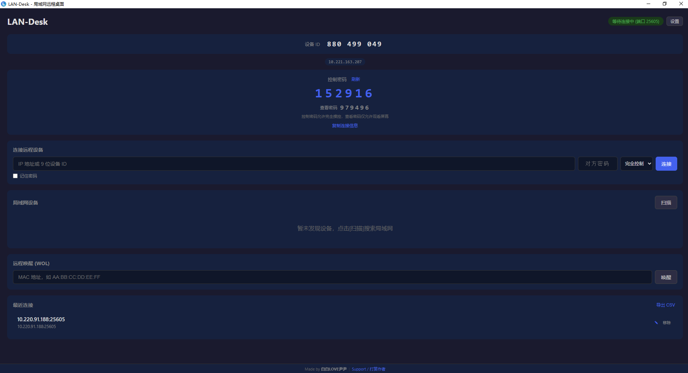
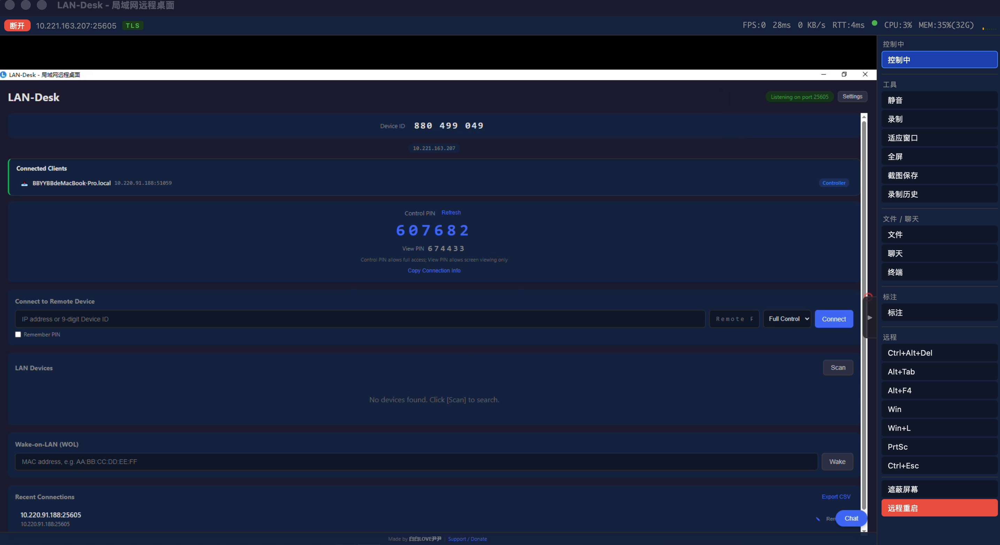

**中文** | [English](#quick-start-english)

# 快速入门指南

LAN-Desk 是一款局域网远程桌面工具，3 分钟即可开始使用。

## 第一步：安装

前往 [Releases](https://github.com/bbyybb/lan-desk/releases/latest) 下载对应平台的安装包：

| 平台 | 文件 | 安装方式 |
|------|------|----------|
| Windows | `.msi` 或 `.exe` | 双击安装 |
| macOS (Apple Silicon) | `_aarch64.dmg` | 拖入 Applications |
| macOS (Intel) | `_x64.dmg` | 拖入 Applications |
| Linux (Debian/Ubuntu) | `.deb` 安装包 | `sudo dpkg -i lan-desk_*.deb` |
| Linux (通用) | `.AppImage` | `chmod +x *.AppImage && ./*.AppImage` |
| Android | `.apk` | 见下方移动端安装说明 |
| iOS | `.ipa` | 见下方移动端安装说明 |

### 移动端安装（Android / iOS）

移动端定位为**仅控制端**——用手机或平板远程操控桌面电脑，不做被控端。

#### Android

1. 前往 [Releases](https://github.com/bbyybb/lan-desk/releases/latest) 下载 `.apk` 文件
2. 将 APK 传到手机（或直接在手机浏览器下载）
3. 打开 APK 安装（需在设置中允许"安装未知应用"）
4. 首次运行需授予**网络权限**

> **提示**：APK 未经 Google Play 签名，安装时会提示"不安全的应用"，点击"仍然安装"即可。

#### iOS

1. 前往 [Releases](https://github.com/bbyybb/lan-desk/releases/latest) 下载 `.ipa` 文件
2. 安装方式（选一种）：
   - **AltStore / SideStore**：在电脑上安装 [AltStore](https://altstore.io/)，通过 USB 或 Wi-Fi 将 IPA 侧载到 iPhone/iPad
   - **Apple Configurator 2**（macOS）：连接设备后拖入 IPA 安装
   - **TestFlight**（需开发者账号）：上传到 App Store Connect 后通过 TestFlight 分发

> **注意**：iOS 侧载的应用需要每 7 天重新签名（免费开发者账号限制），使用付费开发者账号或 AltStore 后台刷新可解决。

#### 移动端操作说明

- **单指拖动** = 鼠标移动
- **单指轻触** = 鼠标左键点击
- **长按** = 鼠标右键
- **双指捏合/滑动** = 滚轮滚动
- **虚拟键盘按钮**（右下角浮动按钮）= 弹出键盘输入

### Linux 系统依赖

```bash
# Ubuntu/Debian
sudo apt-get install -y libx11-dev libxext-dev libxtst-dev libxrandr-dev \
  libxcb-shm0-dev libxcb1-dev libxcb-randr0-dev libasound2-dev \
  libwebkit2gtk-4.1-dev libgtk-3-dev libayatana-appindicator3-dev librsvg2-dev

# Fedora
sudo dnf install -y libX11-devel libXext-devel libXtst-devel libXrandr-devel \
  libxcb-devel alsa-lib-devel webkit2gtk4.1-devel gtk3-devel libappindicator-gtk3-devel librsvg2-devel
```

> **macOS 用户**：首次运行需授权 系统设置 → 隐私与安全 → **屏幕录制** + **辅助功能**。LAN-Desk 会自动检测权限状态并弹出引导提示。

## 第二步：启动应用

两台局域网内的电脑都运行 LAN-Desk。

启动后你会看到「设备发现页」：
- 上方显示 **控制密码**（蓝色大字）和 **查看密码**（灰色小字）
- 控制密码允许完全操控，查看密码仅允许观看屏幕



## 第三步：连接

**在控制端**（你的电脑）：
1. 输入被控端的 **IP 地址**（如 `192.168.1.10`）
2. 输入被控端显示的 **PIN 密码**
3. 选择 **完全控制** 或 **仅查看**
4. 点击 **连接**

> 也可以点击「扫描」自动发现局域网内的设备

**在被控端**：
- 会弹出确认窗口，点击 **允许** 即可

## 第四步：开始使用

连接成功后进入远程桌面界面：



**工具栏功能**：
- **控制/查看切换**：切换是否发送键鼠操作
- **文件传输**：选择文件发送到对方电脑
- **终端**：打开远程命令行终端（Shell 空闲 30 分钟后自动超时断开）
- **标注**：在远程画面上自由绘制
- **录制**：录制屏幕为 WebM 视频
- **全屏**：全屏查看远程桌面

### 安全设置

在设置页面中还可以配置：
- **剪贴板同步**：关闭后不再自动同步远端剪贴板内容
- **允许远程终端**：默认关闭，开启后远程端可打开终端会话（建议仅在需要时开启以提高安全性）

## 无人值守模式

如果需要远程访问无人看管的电脑：
1. 进入 **设置**
2. 开启 **自动接受连接**（跳过确认弹窗）
3. 开启 **固定密码**（密码不会每次刷新）

---

<a id="quick-start-english"></a>

# Quick Start Guide (English)

LAN-Desk is a LAN remote desktop tool. Get started in 3 minutes.

## Step 1: Install

Download from [Releases](https://github.com/bbyybb/lan-desk/releases/latest):

| Platform | File | Installation |
|----------|------|-------------|
| Windows | `.msi` or `.exe` | Double-click to install |
| macOS (Apple Silicon) | `_aarch64.dmg` | Drag to Applications |
| macOS (Intel) | `_x64.dmg` | Drag to Applications |
| Linux (Debian/Ubuntu) | `.deb` package | `sudo dpkg -i lan-desk_*.deb` |
| Linux (Generic) | `.AppImage` | `chmod +x *.AppImage && ./*.AppImage` |
| Android | `.apk` | See Mobile Installation below |
| iOS | `.ipa` | See Mobile Installation below |

### Mobile Installation (Android / iOS)

Mobile devices work as **controller only** — use your phone/tablet to remotely control desktop computers.

#### Android

1. Download the `.apk` from [Releases](https://github.com/bbyybb/lan-desk/releases/latest)
2. Transfer the APK to your phone (or download directly in the phone browser)
3. Open the APK to install (enable "Install unknown apps" in Settings if prompted)
4. Grant **network permission** on first launch

> **Note**: The APK is not signed by Google Play; you may see an "unsafe app" warning — tap "Install anyway".

#### iOS

1. Download the `.ipa` from [Releases](https://github.com/bbyybb/lan-desk/releases/latest)
2. Install using one of these methods:
   - **AltStore / SideStore**: Install [AltStore](https://altstore.io/) on your computer, then sideload the IPA via USB or Wi-Fi
   - **Apple Configurator 2** (macOS): Connect device and drag in the IPA
   - **TestFlight** (requires Developer account): Upload to App Store Connect, distribute via TestFlight

> **Note**: Sideloaded iOS apps must be re-signed every 7 days (free developer account limitation). A paid developer account or AltStore background refresh resolves this.

#### Mobile Controls

- **One-finger drag** = mouse move
- **Single tap** = left click
- **Long press** = right click
- **Two-finger pinch/scroll** = scroll wheel
- **Virtual keyboard button** (floating button, bottom-right) = show keyboard

### Linux System Dependencies

```bash
# Ubuntu/Debian
sudo apt-get install -y libx11-dev libxext-dev libxtst-dev libxrandr-dev \
  libxcb-shm0-dev libxcb1-dev libxcb-randr0-dev libasound2-dev \
  libwebkit2gtk-4.1-dev libgtk-3-dev libayatana-appindicator3-dev librsvg2-dev

# Fedora
sudo dnf install -y libX11-devel libXext-devel libXtst-devel libXrandr-devel \
  libxcb-devel alsa-lib-devel webkit2gtk4.1-devel gtk3-devel libappindicator-gtk3-devel librsvg2-devel
```

> **macOS users**: Grant Screen Recording + Accessibility permissions on first launch. LAN-Desk will automatically detect missing permissions and show a guided prompt.

## Step 2: Launch

Run LAN-Desk on both computers within the same LAN.

You'll see the Discovery page:
- **Control PIN** (blue) — allows full control
- **View PIN** (gray) — allows screen viewing only

## Step 3: Connect

**On the controller** (your computer):
1. Enter the host's **IP address**
2. Enter the host's **PIN**
3. Choose **Full Control** or **View Only**
4. Click **Connect**

**On the host**: Click **Allow** in the confirmation popup.

## Step 4: Use

After connecting, you'll see the remote desktop with a toolbar:
- **Control/View toggle** — switch input mode
- **File** — send files
- **Terminal** — open remote shell (30-minute idle timeout)
- **Annotate** — draw on screen
- **Record** — record to WebM
- **Fullscreen** — fullscreen view

### Security Settings

Additional options available in Settings:
- **Clipboard Sync**: When off, clipboard content will not sync with the remote device
- **Allow Remote Terminal**: Off by default. When enabled, remote users can open terminal sessions (recommended to keep off when not needed for enhanced security)

## Unattended Access

To access an unattended computer:
1. Open **Settings**
2. Enable **Auto Accept Connections**
3. Enable **Fixed Password**
